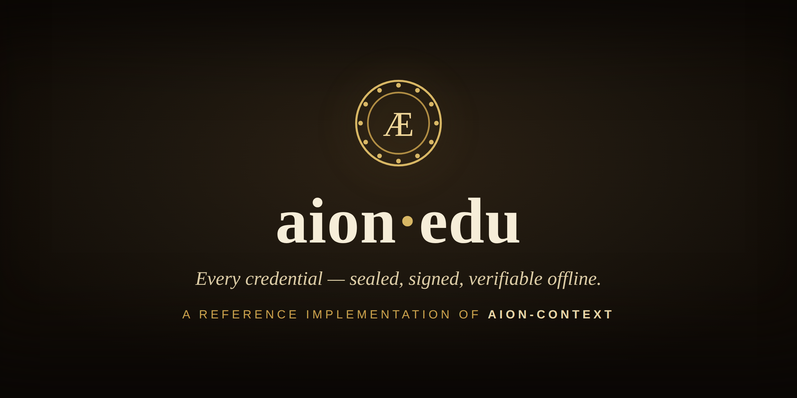

<p align="center">
  
</p>

# aion-edu

[](https://github.com/aion-context/aion-context)
[](LICENSE)


**A reference implementation of [aion-context](https://github.com/aion-context/aion-context) — provenance you can build a university on.**

aion-edu is a synthetic, AI-native university built as a working showcase of
**aion-context**: a tamper-evident, Ed25519-signed, hash-chained provenance kernel.
Every rubric, credential, and act of accreditation is a *signed record* whose history
cannot be altered without breaking the chain — so a diploma proves itself to anyone,
**offline**, with no registrar to call and no database to trust.

It is also a thesis. aion-edu is **not** a replacement for traditional universities —
it is a trust-and-AI **layer** they can adopt: a school exposes its curriculum and
rubrics, AI faculty teach them at any scale, and aion-context seals every credential to
that exact standard. One shared, verifiable record of accuracy that students, employers,
and other institutions can all check independently.

> This repository exists to demonstrate **how to implement aion-context** in a real,
> end-to-end domain — signing, verification, K-of-N multisig, registry epochs, federation,
> and fully offline verification — not as a product. See [`docs/POSITIONING.md`](docs/POSITIONING.md).

## What's inside

- A **7-crate Rust workspace** (Tiger Style: typed errors, no panics in libraries).
- **Live AI faculty** — master-teacher personas that teach to a *signed* rubric and grade
  what they cannot themselves alter (axum + SSE streaming classroom).
- **Cryptographic student identity**, sealed credentials, and a transcript wallet.
- **Federation** — recognition, co-accreditation (K-of-N signatures), delegation,
  revocation via registry epochs, and signed snapshots.
- **Offline verification** — verify a downloaded diploma with nothing but the file and a
  verifier; change one byte and it is refused. (CLI + web.)
- A **cinematic landing** that explains the model, and an interactive classroom.

## Architecture

| Crate | Responsibility |
|-------|----------------|
| `aion-edu-core` | shared types, errors, IDs |
| `aion-edu-provenance` | the aion-context integration: sealing, verification, federation |
| `aion-edu-teach` | the teaching loop, learners, ledger of mastery |
| `aion-edu-faculty` | professor personas (one-file plug-ins via `inventory`) |
| `aion-edu-curriculum` | courses, units, lessons, rubrics |
| `aion-edu-web` | axum server: landing, classroom (SSE), federation console |
| `aion-edu-cli` | `seal`, `serve`, `teach`, `federate`, `verify-diploma` |

## How aion-context is used (the reference part)

aion-edu wires aion-context through its full surface:

- **Sealing rubrics** → signed, versioned records (`sign_attestation`, `commit_version`).
- **Issuing credentials** bound to the exact rubric hash; **verifying** them offline (`verify_file`).
- **Federation trust** via the key registry (`KeyRegistry::register_author`), **K-of-N
  multisig** for joint degrees (`MultiSigPolicy::m_of_n`, `verify_multisig`), and **scoped
  trust** through registry epochs (delegation / revocation).

## Quick start

`aion-context` is a **path dependency** — clone it as a sibling directory:

```bash
git clone https://github.com/aion-context/aion-context
git clone https://github.com/aion-context/aion-edu
cd aion-edu

cargo build
./target/debug/aion-edu seal               # seal every rubric onto the ledger
ANTHROPIC_API_KEY=… ./target/debug/aion-edu serve   # http://127.0.0.1:8080
```

Then open `/` (the film), `/learn` (the classroom), and `/federate` (the federation
console). Live lessons require an `ANTHROPIC_API_KEY`. Useful CLI verbs:

```bash
aion-edu teach <lesson> --learner <name>   # run a live lesson, mint a credential
aion-edu federate recognize <a> <b>        # institutions recognize one another
aion-edu verify-diploma <diploma.json>     # verify a credential offline
```

## Runtime data & secrets

- `aion-edu-data/` holds the **signing keys and ledger** — it is gitignored and never
  committed. It is regenerated by `aion-edu seal`.
- The narration/film assets are generated, not checked in. To regenerate audio, copy
  `eleven.env.example` → `eleven.env` (an ElevenLabs key) and run `tools/gen-narration.py`.
  See also `tools/pron-dict.env.example`.

## License

See [`LICENSE`](LICENSE).
